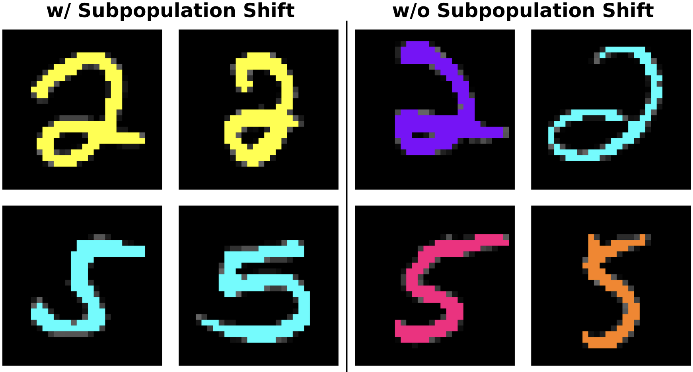

# Dataset Bias Analysis Framework

<p align="center">
  
</p>

## Overview

**Dataset Bias Analysis (DBA)** is a framework for correcting the bias and discrepancies between the training set and the testing set for a higher test set performance given the prevalent of _subpopulation shift_.
This repo conains the implementation code of the framework, which is published as a the paper [Boosting Test Performance with Importance Sampling--a Subpopulation Perspective](https://arxiv.org/pdf/2412.13003) (Shen et al., AAAI 2025).


## Preparation
Note that the implementation of the DBA method is based on a hacking of the repo published with the paper [Change is Hard: A Closer Look at Subpopulation Shift](https://arxiv.org/abs/2302.12254) (Yang et al., ICML 2023). If you use this repo, please consider citing both the DBA paper and this one. For details, please [go to the Citation section](#Citation).

### Installation
Run the following commands to create a conda environment for running this code:

```bash
git clone git@github.com:skyve2012/DBA.git
cd DBA/
conda env create -f subpopulation_env.yml
```

Alternatively, one can also refer to the [Change is Hard](https://github.com/YyzHarry/SubpopBench/blob/main/README.md#:~:text=Run%20the%20following%20commands%20to%20clone%20this%20repo%20and%20create%20the%20Conda%20environment:) repo to install the package there and refer to [`subpopulation_env.yml`](./subpopulation_env.yml) for other missing packages.

### Download datasets
There are three datasets discussed in the paper:
* ColorMNIST ([Nam et al. 2020; Tsirigotis et al. 2024](https://proceedings.neurips.cc/paper/2020/file/eddc3427c5d77843c2253f1e799fe933-Paper.pdf))
* Waterbirds ([Wah et al., 2011](https://authors.library.caltech.edu/27452/))
* CivilComments ([Borkan et al., 2019](https://arxiv.org/abs/1903.04561)) from the [WILDS benchmark](https://arxiv.org/abs/2012.07421)

To facilitate the implementation, the datasets can be found at the [Google Drive](https://drive.google.com/drive/folders/1a76Pzxd7nN4wmonmfv7ybzO9UFGFVePP?usp=share_link).

## Dataset Bias Correction Method
To start with the correction method, we need to follow the three steps in order.

### Model Overfit
In the following, we use ColorMNIST dataset as an example. The same logic can be applied to other datasets.
The first step is to overfit the training and the validation set to generate two models. To achieve this, run the following code:
```bash
# overfit on the training set 
python ./subpopbench/train.py --algorithm ERM --dataset CMNISTV2 --train_attr no --data_dir path/to/dataset/parent/folder --output_dir path/to/model/folder --output_folder_name output_folder_name --cmnistv2_difficult 2pct 
```

```bash
# overfit on the validation set 
python ./subpopbench/train.py --algorithm ERM --dataset CMNISTV2 --train_attr no --data_dir path/to/dataset/parent/folder --output_dir path/to/model/folder --output_folder_name output_folder_name --cmnistv2_difficult 2pct --switch_train_valid
```

### Obtain Sample Weights
Once the models are trained, we can run the following code to obtain sample weights for the training set. The weights are saved in ``model.pkl`` as a dictionary with a key value: ``aligned_weights``. Note that we specify ``steps=1`` to indicate no training. So the script will only obtain model pretrained weights and generate the sample weights for the trianing set.

```bash
# using training set model
python ./subpopbench/train.py --algorithm ERM --dataset CMNISTV2 --train_attr no --data_dir path/to/dataset/parent/folder --output_dir path/to/model/folder --output_folder_name output_folder_name --gen_weights --pretrained path/to/model/overfitted/on/training/set --steps 1 --cmnistv2_difficult 2pct --switch_train_valid
```

```bash
# using training set model
python ./subpopbench/train.py --algorithm ERM --dataset CMNISTV2 --train_attr no --data_dir path/to/dataset/parent/folder --output_dir path/to/model/folder --output_folder_name output_folder_name --gen_weights --pretrained path/to/model/overfitted/on/validation/set --steps 1 --cmnistv2_difficult 2pct
```

### Correct the Bias
To correct bias, one need to first convert the sample weights into respective ``.npy`` files and run the following code depending on different situations
### Known Attribute
```bash
python ./subpopbench/train.py --algorithm DBCM --dataset CMNISTV2 --train_attr yes --data_dir path/to/dataset/parent/folder --output_dir path/to/model/folder --output_folder_name output_folder_nam --sample_weights_path_valid  path/to/sample_weights/from/validation_set/model --sample_weights_path path/to/sample_weights/from/train_set/model  --tau_valid 1000. --tau_train 1. --cmnistv2_difficult 2pct --p_maj 0.98
```
### Unkonwn Attribute and Same Train-validation Data Composition 
```bash
python ./subpopbench/train.py --algorithm DBCM --dataset CMNISTV2 --train_attr no --data_dir path/to/dataset/parent/folder --output_dir path/to/model/folder --output_folder_name output_folder_nam --sample_weights_path_valid  path/to/sample_weights/from/validation_set/model --sample_weights_path path/to/sample_weights/from/train_set/model  --tau_valid 1000. --tau_train 1. --cmnistv2_difficult 2pct --p_maj 0.98
```

### Unkonwn Attribute and Different Train-validation Data Composition 
```bash
python ./subpopbench/train.py --algorithm DBCM --dataset CMNISTV2 --train_attr no --data_dir path/to/dataset/parent/folder --output_dir path/to/model/folder --output_folder_name output_folder_nam --sample_weights_path_valid  path/to/sample_weights/from/validation_set/model --sample_weights_path path/to/sample_weights/from/train_set/model  --tau_valid 1000. --tau_train 1. --cmnistv2_difficult 2pct --p_maj 0.98 --reverse_logic
```

## Citation

```bib
@inproceedings{shen2025subpopulation,
  title={{Boosting Test Performance with Importance Sampling--a Subpopulation Perspective}},
  author={Shen, Hongyu and Zhao, Zhizhen},
  booktitle={he Association for the Advancement
of Artificial Intelligence},
  year={2025}
}
```

```bib
@inproceedings{yang2023change,
  title={Change is Hard: A Closer Look at Subpopulation Shift},
  author={Yang, Yuzhe and Zhang, Haoran and Katabi, Dina and Ghassemi, Marzyeh},
  booktitle={International Conference on Machine Learning},
  year={2023}
}
```
